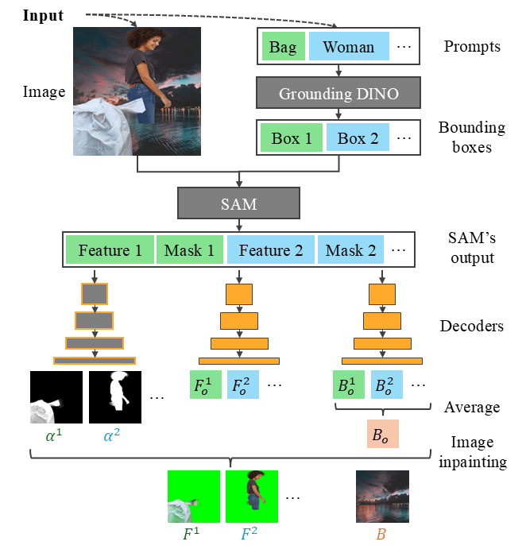

# Image Matting for Image Editing with Occlusions

Official implementation of the ICONIP 2024 paper "Image Matting for Image Editing with Occlusions".
<!-- [Image Matting for Image Editing with Occlusions](https://xxx).  -->

<p align="middle">
    
</p>

## Data Preparation

### Datasets
- **Foregrounds**:  
    We use images from the [Adobe Image Matting dataset](https://github.com/foamliu/Deep-Image-Matting) and the [Distinctions-646 dataset](https://github.com/yuhaoliu7456/CVPR2020-HAttMatting).
- **Backgrounds**:  
    Backgrounds are sourced from the [MSCOCO dataset](http://cocodataset.org/#download) and the [BG20K dataset](https://github.com/JizhiziLi/GFM#bg-20k).

### Building the Test Dataset
To build the test dataset, please run:
```
python build_test_data.py
```

## Model Preparation
Our model requires initialization using the Matting Anything Model checkpoint.
Please download the checkpoint from [here](https://github.com/SHI-Labs/Matting-Anything).

## Training the Model
To train our model, please run:
```
python train.py --config config/MAM-ViTB.toml
```

## Testing the Model

### Image Matting

Evaluate the image matting performance by running:
```
python test_matting.py
```

### Image Editing

Evaluate the image editing performance by running:
```
python test_edit.py
```

**Note**: Please ensure to run `test_matting.py` first, as the image editing step requires the results generated by the image matting step.

## Acknowledgement
Thanks to the code base from [Segment Anything Model](https://github.com/facebookresearch/segment-anything), [Matting Anything Model](https://github.com/SHI-Labs/Matting-Anything), and [Grounding DINO](https://github.com/IDEA-Research/GroundingDINO).

<!-- ## Citation
If you find our code or paper helps, please consider citing:
```
``` -->
